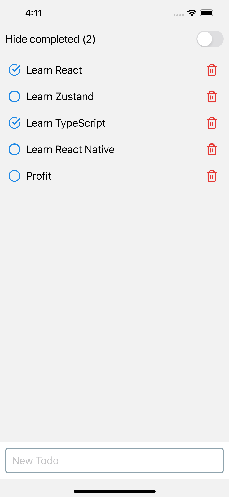
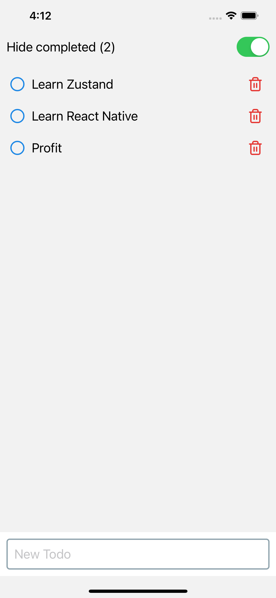
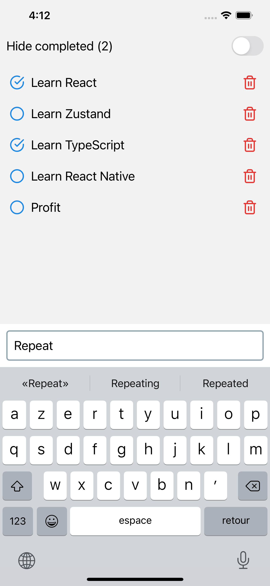

# Tode List

Application React Native ([Expo](https://expo.dev/)).

Gestion du state avec [Zustand](https://github.com/pmndrs/zustand).

## Screenshots

|  |  |  |
| -------------------------------- | ------------------------------------ | -------------------------------------- |
| Liste                            | Filtres                              | Ajout                                  |
